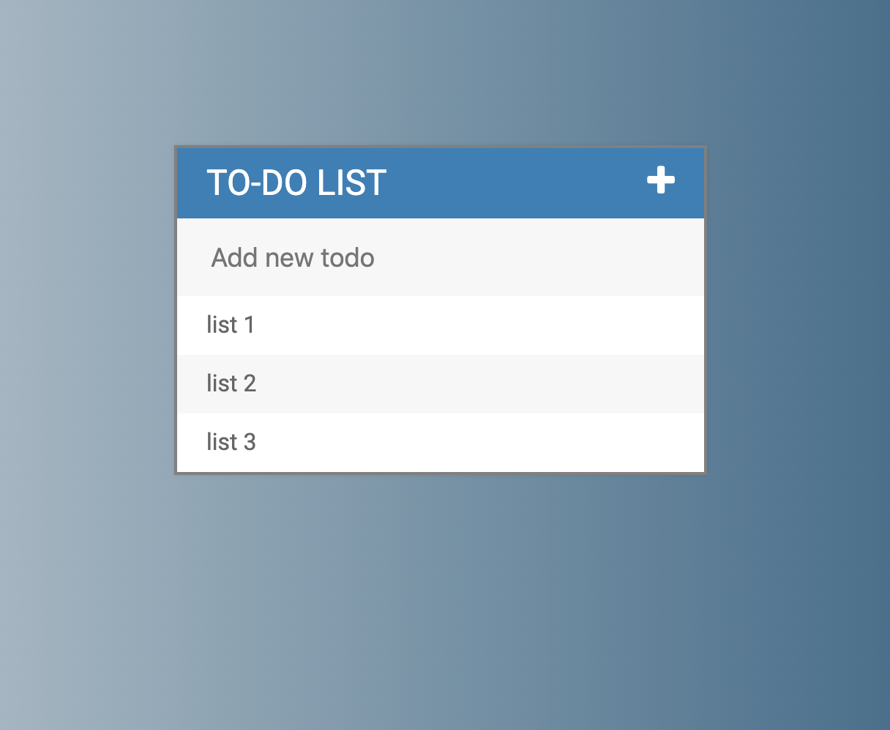
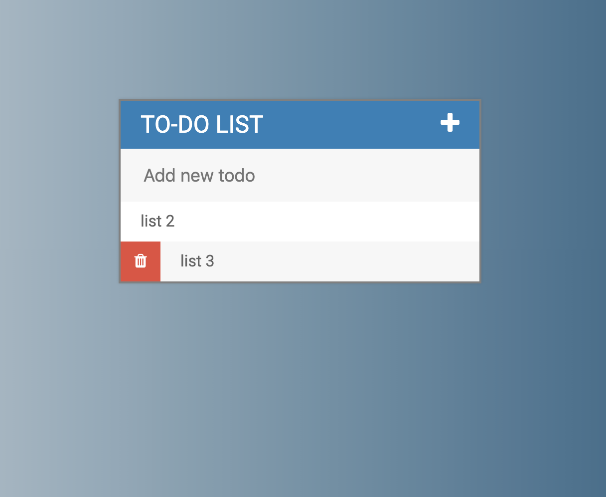

# To-Do Page
This is a simple static webpage created to explore the basics of jQuery working in combination with css.
Features responsive layout and simple transitions.

## Installation
1. Clone repository.
2. Open `index.html` in your browser.

## Example Screens

